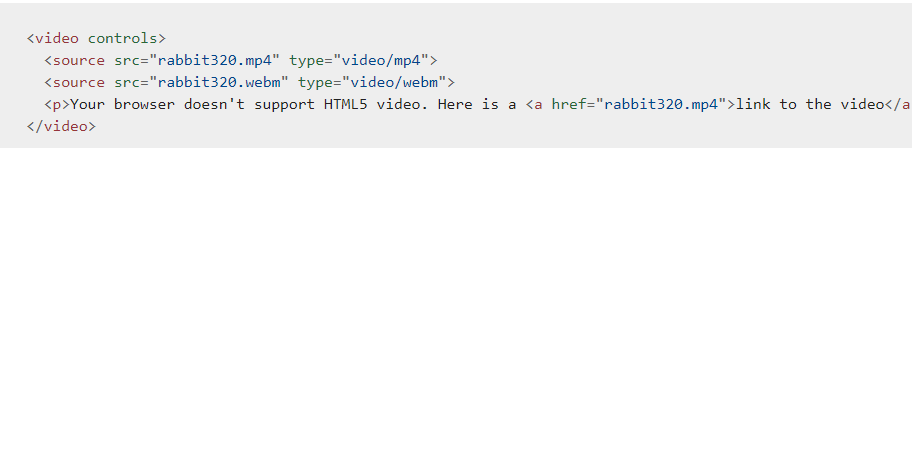
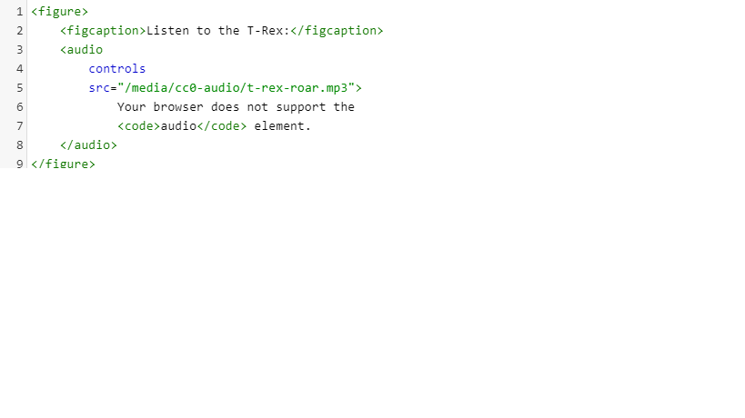

# Images:

-Images can be aligned both horizontally and vertically
using CSS.

-You can use a background image behind the box
created by any element on a page.

-Background images can appear just once or be
repeated across the background of the box .

-You can create image rollover effects by moving the
background position of an image.

-To reduce the number of images your browser has to
load, you can create image sprites.

*Site maps allow you to plan the structure of a site.*

*Wireframes allow you to organize the information that
will need to go on each page.*

*You can differentiate between pieces of information
using size, color, and style.*

# Audio, Video:

Flash is a very popular technology used
to add animations, video, and audio to
websites.

