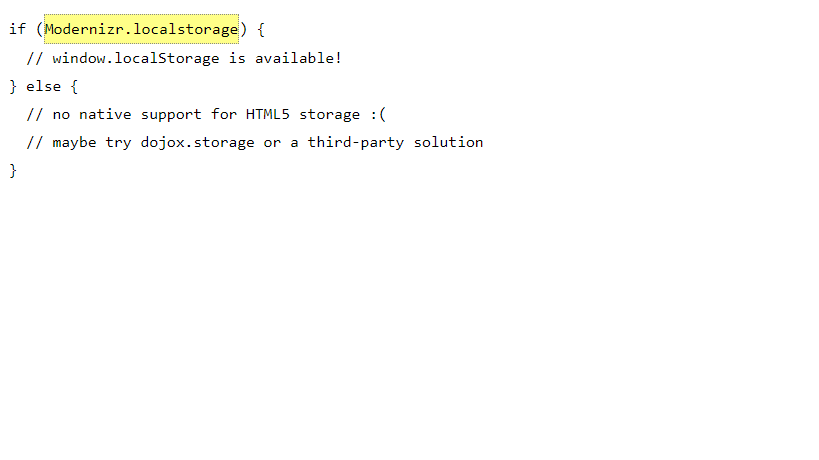

# Local Storage:

**what the meaning of local storage ?**

A hard drive or solid state drive (SSD) directly attached to the device being referenced. The term would be used to contrast the storage in that unit from the storage on servers in the local network or on the Internet

-check for HTML5 Storage:
 
 

-using HTML5 storage :

HTML5 Storage is based on named key/value pairs. You store data based on a named key, then you can retrieve that data with the same key. The named key is a string. The data can be any type supported by JavaScript, including strings, Booleans, integers, or floats. However, the data is actually stored as a string. If you are storing and retrieving anything other than strings, you will need to use functions like parseInt() or parseFloat ()to coerce your retrieved data into the expected JavaScript datatype.

interface Storage {

  getter any getItem(in DOMString key);

  setter creator void setItem(in DOMString key, in any data);
  
};