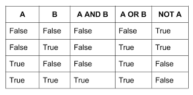

#Logical operators :
*Logical operators are typically used with Boolean (logical) values; when they are, they return a Boolean value.*
-AND(&&)

-OR(||)

-NOT(!)

#turth table

#loop :
Loops offer a quick and easy way to do something repeatedly.

There are many different kinds of loops, but they all essentially do the same thing: they repeat an action some number of times .
The statements for loops provided in JavaScript are:

-for statement

-while statement

-do...while statement

for :

A for loop repeats until a specified condition evaluates to false .
 
 for ([initialExpression]; [conditionExpression]; [incrementExpression])

  statement

 while :

 A while statement executes its statements as long as a specified condition evaluates to true .

 while (condition)
 
  statement

